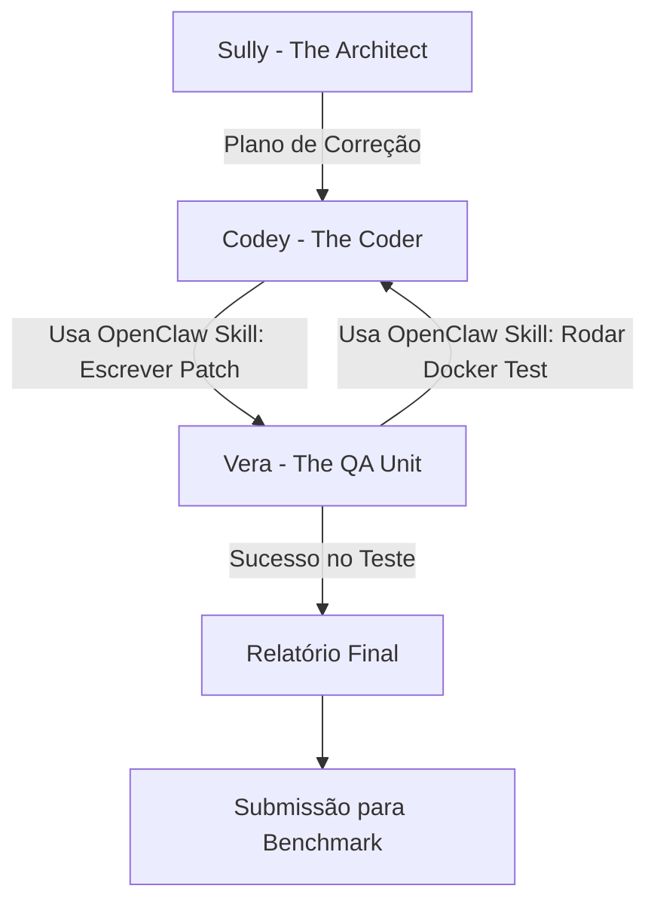

# Design do Sistema: MAS via OpenClaw para SWE-bench (Artigo 1)

Este documento detalha o "motor" do nosso artigo: como os Agentes Pequenos (SLMs) vão colaborar usando o framework **OpenClaw** para bater modelos gigantes.

## 1. Requisitos de Ambiente Local
Para rodar este experimento com 100% de privacidade e custo zero:
- **Ollama:** Servidor de modelos local (Llama-3, Phi-3).
- **OpenClaw:** Framework agêntico "Local-First" que fará a orquestração e uso de ferramentas.
- **Docker / NemoClaw:** Para rodar o **SWE-bench** de forma segura, executando os containers isolados para testar os patches gerados pelo OpenClaw.
- **Hardware Recomendado:** GPU com no mínimo 8GB de VRAM (desktop do lab) ou 4GB (testes locais em casa com modelos menores).

## 2. Fluxo de Interação via OpenClaw

### Papéis Detalhados (AgentSkills):
1. **Sully (Architect):** Usa *Skills* do OpenClaw para ler a `issue_description` e buscar arquivos relevantes (`grep` ou `find` skill). Gera um plano de correção em alto nível.
2. **Codey (Coder):** Recebe o plano. Usa a *Skill* de edição de arquivo nativa do OpenClaw para editar o código e aplicar a mudança.
3. **Vera (QA Unit):** Usa a *Skill* de terminal do OpenClaw para disparar o script de teste do SWE-bench no Docker. Ela captura o *stdout* e decide se a issue foi consertada.

## 3. Por que isso é inovador?
Em modelos gigantes, o modelo tenta fazer tudo de uma vez. No nosso MAS, a **Vera (QA)** atua como um "corretor gramatical e lógico" constante, permitindo que modelos pequenos (que têm menos memória de curto prazo) foquem em tarefas atômicas e precisas.

## 4. Próximos Passos
- [ ] Validar a GPU do laboratório (Comando: `nvidia-smi`).
- [ ] Instalar Ollama e baixar o modelo `llama3:8b`.
- [ ] Escrever o primeiro script de teste com uma issue simples do Django.
